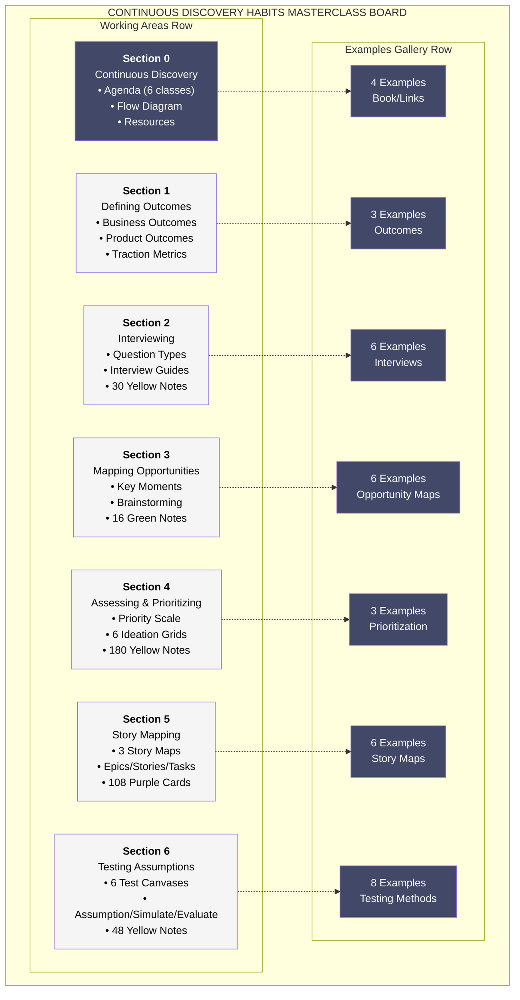
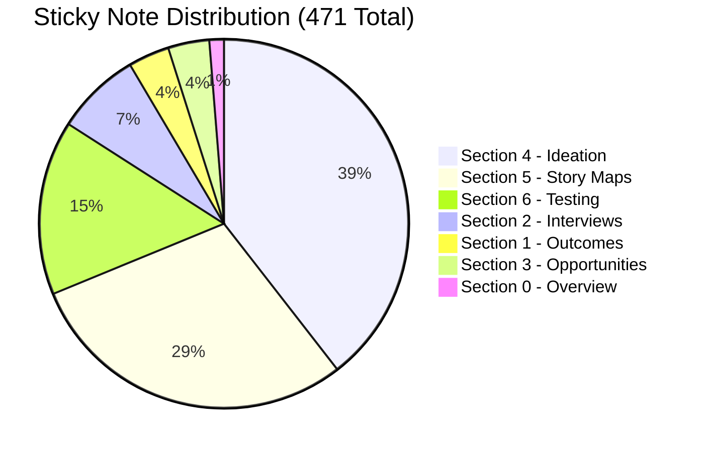
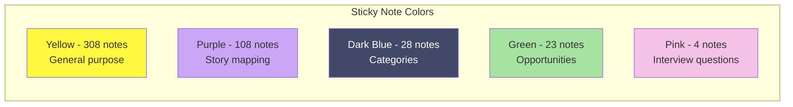

# Continuous Discovery Habits Board Structure

## High-Level Board Architecture

```mermaid
graph TB
    subgraph "CONTINUOUS DISCOVERY HABITS MASTERCLASS BOARD"
        subgraph "Working Areas Row"
            S0["<b>Section 0</b><br/>Continuous Discovery<br/>• Agenda (6 classes)<br/>• Flow Diagram<br/>• Resources"]
            S1["<b>Section 1</b><br/>Defining Outcomes<br/>• Business Outcomes<br/>• Product Outcomes<br/>• Traction Metrics"]
            S2["<b>Section 2</b><br/>Interviewing<br/>• Question Types<br/>• Interview Guides<br/>• 30 Yellow Notes"]
            S3["<b>Section 3</b><br/>Mapping Opportunities<br/>• Key Moments<br/>• Brainstorming<br/>• 16 Green Notes"]
            S4["<b>Section 4</b><br/>Assessing & Prioritizing<br/>• Priority Scale<br/>• 6 Ideation Grids<br/>• 180 Yellow Notes"]
            S5["<b>Section 5</b><br/>Story Mapping<br/>• 3 Story Maps<br/>• Epics/Stories/Tasks<br/>• 108 Purple Cards"]
            S6["<b>Section 6</b><br/>Testing Assumptions<br/>• 6 Test Canvases<br/>• Assumption/Simulate/Evaluate<br/>• 48 Yellow Notes"]
        end
        
        subgraph "Examples Gallery Row"
            E0[4 Examples<br/>Book/Links]
            E1[3 Examples<br/>Outcomes]
            E2[6 Examples<br/>Interviews]
            E3[6 Examples<br/>Opportunity Maps]
            E4[3 Examples<br/>Prioritization]
            E5[6 Examples<br/>Story Maps]
            E6[8 Examples<br/>Testing Methods]
        end
    end

    S0 -.-> E0
    S1 -.-> E1
    S2 -.-> E2
    S3 -.-> E3
    S4 -.-> E4
    S5 -.-> E5
    S6 -.-> E6

    style S0 fill:#424867,color:#fff
    style S1 fill:#f5f5f5,color:#000
    style S2 fill:#f5f5f5,color:#000
    style S3 fill:#f5f5f5,color:#000
    style S4 fill:#f5f5f5,color:#000
    style S5 fill:#f5f5f5,color:#000
    style S6 fill:#f5f5f5,color:#000
    style E0 fill:#424867,color:#fff
    style E1 fill:#424867,color:#fff
    style E2 fill:#424867,color:#fff
    style E3 fill:#424867,color:#fff
    style E4 fill:#424867,color:#fff
    style E5 fill:#424867,color:#fff
    style E6 fill:#424867,color:#fff
```

## Entity Distribution by Section

```mermaid
pie title Sticky Note Distribution (471 Total)
    "Section 4 - Ideation" : 186
    "Section 5 - Story Maps" : 138
    "Section 6 - Testing" : 72
    "Section 2 - Interviews" : 35
    "Section 1 - Outcomes" : 17
    "Section 3 - Opportunities" : 17
    "Section 0 - Overview" : 6
```

## Color Usage Breakdown

```mermaid
graph LR
    subgraph "Sticky Note Colors"
        Y[Yellow - 308 notes<br/>General purpose]
        P[Purple - 108 notes<br/>Story mapping]
        DB[Dark Blue - 28 notes<br/>Categories]
        G[Green - 23 notes<br/>Opportunities]
        PK[Pink - 4 notes<br/>Interview questions]
    end
    
    style Y fill:#FFF740
    style P fill:#CBA6F7
    style DB fill:#424867,color:#fff
    style G fill:#A6E3A1
    style PK fill:#F5C2E7
```