# 📊 Continuous Discovery Habits Masterclass - Board Structure (Source of Truth)

## Board Overview
This document serves as the definitive source of truth for the Miro board structure based on the original screenshots.

## Complete Board Structure Diagram

```mermaid
graph TB
    subgraph "Board: Continuous Discovery Habits Masterclass"
        
        subgraph "Section 0: Continuous Discovery"
            S0[0. CONTINUOUS DISCOVERY HABITS MASTERCLASS]
            S0A[AGENDA<br/>Dark Panel]
            S0B[Continuous Discovery<br/>Flow Diagram]
            S0C[6 Green Flow Nodes<br/>3 Yellow Milestones]
            S0D[EXAMPLES<br/>Dark Panel]
            S0E[4 Logo Elements<br/>Slack, Product Talk]
            
            S0 --> S0A
            S0 --> S0B
            S0B --> S0C
            S0 --> S0D
            S0 --> S0E
        end
        
        subgraph "Section 1: Defining Outcomes"
            S1[1. DEFINING OUTCOMES]
            S1H[EVIDENCE-BASED TEAM DECISIONS<br/>Header]
            S1A[BUSINESS OUTCOMES<br/>Dark Panel]
            S1A1[3 Yellow Sticky Notes]
            S1B[PRODUCT OUTCOMES<br/>Dark Panel]
            S1B1[6 Yellow Sticky Notes<br/>2x3 Grid]
            S1C[TRACTION METRICS<br/>Dark Panel]
            S1C1[8 Yellow Sticky Notes<br/>2x4 Grid]
            
            S1 --> S1H
            S1H --> S1A --> S1A1
            S1H --> S1B --> S1B1
            S1H --> S1C --> S1C1
        end
        
        subgraph "Section 2: Interviewing"
            S2[2. INTERVIEWING]
            S2H[CONTINUOUS INTERVIEWING TO<br/>DISCOVER OPPORTUNITIES<br/>Header]
            S2A[WHO TO INTERVIEW<br/>Dark Panel]
            S2A1[5 Yellow Sticky Notes]
            S2B[HOW TO RECRUIT<br/>Dark Panel]
            S2B1[5 Yellow Sticky Notes]
            S2C[WHEN TO INTERVIEW<br/>Dark Panel]
            S2C1[5 Yellow Sticky Notes]
            S2D[HOW TO INTERVIEW<br/>Dark Panel]
            S2D1[5 Yellow Sticky Notes]
            S2E[WHAT TO CAPTURE<br/>Dark Panel]
            S2E1[5 Yellow Sticky Notes]
            S2F[6 Pink Research Notes]
            S2G[EXAMPLES<br/>Dark Panel]
            S2G1[6 Example Images]
            
            S2 --> S2H
            S2H --> S2A --> S2A1
            S2H --> S2B --> S2B1
            S2H --> S2C --> S2C1
            S2H --> S2D --> S2D1
            S2H --> S2E --> S2E1
            S2H --> S2F
            S2 --> S2G --> S2G1
        end
        
        subgraph "Section 3: Mapping Opportunities"
            S3[3. MAPPING OPPORTUNITIES]
            S3H[MAPPING OPPORTUNITIES<br/>Header]
            S3A[OPPORTUNITY SOLUTION TREE<br/>Label]
            S3B[12 Green Opportunities<br/>Hierarchical]
            S3C[3 Blue Hierarchy Nodes]
            S3D[EXAMPLES<br/>Dark Panel]
            S3D1[6 Example Images]
            
            S3 --> S3H
            S3H --> S3A
            S3A --> S3B
            S3A --> S3C
            S3 --> S3D --> S3D1
        end
        
        subgraph "Section 4: Assessing & Prioritizing"
            S4[4. ASSESSING & PRIORITIZING]
            S4H[ASSESSING & PRIORITIZING OPPORTUNITIES,<br/>EFFECTIVE SOLUTION IDEATION<br/>Header]
            S4A[13 Priority Scale Dots<br/>Red to Green Gradient]
            S4B[4 Category Labels<br/>Blue, Green, Yellow, Pink]
            S4C[CONTEXT-DRIVEN PRIORITIZATION<br/>Dark Panel]
            S4D[PRIORITIZING OPPORTUNITIES<br/>Dark Panel]
            S4E[EFFECTIVE IDEATION<br/>Dark Panel]
            S4F[6 Ideation Grids<br/>5x5 Yellow Sticky Notes<br/>Total: 150]
            S4G[EXAMPLES<br/>Dark Panel]
            S4G1[3 Example Images]
            
            S4 --> S4H
            S4H --> S4A
            S4H --> S4B
            S4H --> S4C
            S4H --> S4D
            S4H --> S4E
            S4H --> S4F
            S4 --> S4G --> S4G1
        end
        
        subgraph "Section 5: Solution Story Mapping"
            S5[5. SOLUTION STORY MAPPING]
            S5H[STORY MAPPING,<br/>ASSUMPTION MAPPING<br/>Header]
            S5A[STORY MAP 1]
            S5A1[10 Yellow Epics/Stories<br/>2 Rows]
            S5A2[36 Purple Tasks<br/>6x6 Grid]
            S5B[STORY MAP 2]
            S5B1[10 Yellow Epics/Stories<br/>2 Rows]
            S5B2[36 Purple Tasks<br/>6x6 Grid]
            S5C[STORY MAP 3]
            S5C1[10 Yellow Epics/Stories<br/>2 Rows]
            S5C2[36 Purple Tasks<br/>6x6 Grid]
            S5D[EXAMPLES<br/>Dark Panel]
            S5D1[6 Example Images]
            
            S5 --> S5H
            S5H --> S5A
            S5A --> S5A1
            S5A --> S5A2
            S5H --> S5B
            S5B --> S5B1
            S5B --> S5B2
            S5H --> S5C
            S5C --> S5C1
            S5C --> S5C2
            S5 --> S5D --> S5D1
        end
        
        subgraph "Section 6: Testing Assumptions"
            S6[6. TESTING ASSUMPTIONS]
            S6H[TESTING ASSUMPTIONS<br/>Header]
            S6A[ASSUMPTION<br/>Dark Panel]
            S6B[SIMULATE<br/>Dark Panel]
            S6C[EVALUATE<br/>Dark Panel]
            S6D[6 Test Canvases<br/>2x3 Layout]
            S6D1[Canvas: 4 Dark Blue Labels<br/>8 Yellow Results<br/>x6 = 24 Blue + 48 Yellow]
            S6E[EXAMPLES<br/>Dark Panel]
            S6E1[10 Example Images]
            
            S6 --> S6H
            S6H --> S6A
            S6H --> S6B
            S6H --> S6C
            S6H --> S6D --> S6D1
            S6 --> S6E --> S6E1
        end
    end
    
    style S0 fill:#f9f,stroke:#333,stroke-width:4px
    style S1 fill:#ff9,stroke:#333,stroke-width:4px
    style S2 fill:#9ff,stroke:#333,stroke-width:4px
    style S3 fill:#9f9,stroke:#333,stroke-width:4px
    style S4 fill:#f99,stroke:#333,stroke-width:4px
    style S5 fill:#99f,stroke:#333,stroke-width:4px
    style S6 fill:#f9f,stroke:#333,stroke-width:4px
```

## Current Implementation Status

### ✅ Complete Sections
- **Section 1**: All sticky notes present, needs dark panel headers
- **Section 3**: All opportunities and nodes present, needs label
- **Section 5**: All story maps complete
- **Section 6**: All test canvases complete

### ⚠️ Sections Needing Headers
- **Section 0**: Missing EXAMPLES panel
- **Section 1**: Missing PRODUCT OUTCOMES and TRACTION METRICS panels
- **Section 2**: Missing ALL 7 dark panel headers (critical)
- **Section 3**: Missing OPPORTUNITY SOLUTION TREE label and EXAMPLES panel
- **Section 4**: Missing ALL 5 dark panel headers
- **Section 5**: Missing EXAMPLES panel
- **Section 6**: Missing main header and EXAMPLES panel

## Sticky Note Count Summary

| Section | Color | Expected | Current | Status |
|---------|-------|----------|---------|--------|
| 0 | Green | 3 | 3 | ✅ |
| 0 | Yellow | 3 | 0 | ❌ |
| 1 | Yellow | 17 | 17 | ✅ |
| 2 | Yellow | 25 | 25 | ✅ |
| 2 | Pink | 6 | 6 | ✅ |
| 3 | Green | 12 | 12 | ✅ |
| 3 | Blue | 3 | 3 | ✅ |
| 4 | Yellow | 150 | 149 | 99% |
| 5 | Yellow | 30 | 30 | ✅ |
| 5 | Purple | 108 | 108 | ✅ |
| 6 | Dark Blue | 24 | 24 | ✅ |
| 6 | Yellow | 48 | 48 | ✅ |
| **Total** | All | **429** | **425** | **99%** |

## Missing Visual Elements

### Dark Panel Headers (16 missing)
Most critical for visual organization and section clarity:
1. Section 0: EXAMPLES
2. Section 1: PRODUCT OUTCOMES, TRACTION METRICS
3. Section 2: ALL 7 headers (WHO, HOW, WHEN, HOW, WHAT, EXAMPLES)
4. Section 3: EXAMPLES
5. Section 4: ALL 5 headers
6. Section 5: EXAMPLES
7. Section 6: EXAMPLES

### Example Images (36 placeholders needed)
- Section 0: 1 example panel
- Section 2: 6 examples
- Section 3: 6 examples
- Section 4: 3 examples
- Section 5: 6 examples
- Section 6: 10 examples

### Other Elements
- Flow diagram structure (Section 0)
- Priority scale dots (Section 4)
- Logo elements (Section 0)

## Priority Fixes

### 🔴 Priority 1: Section 2 Headers
Section 2 (Interviewing) is completely missing its organizational structure. Needs:
- Main header
- 5 subsection panels
- Examples panel

### 🟡 Priority 2: Section 4 Headers
Section 4 (Assessing & Prioritizing) needs its structure:
- Main header
- 3 methodology panels
- Examples panel

### 🟢 Priority 3: Other Headers
Complete remaining sections with missing panels

---

*Last Updated: August 8, 2025*
*This document represents the definitive structure based on original screenshots*