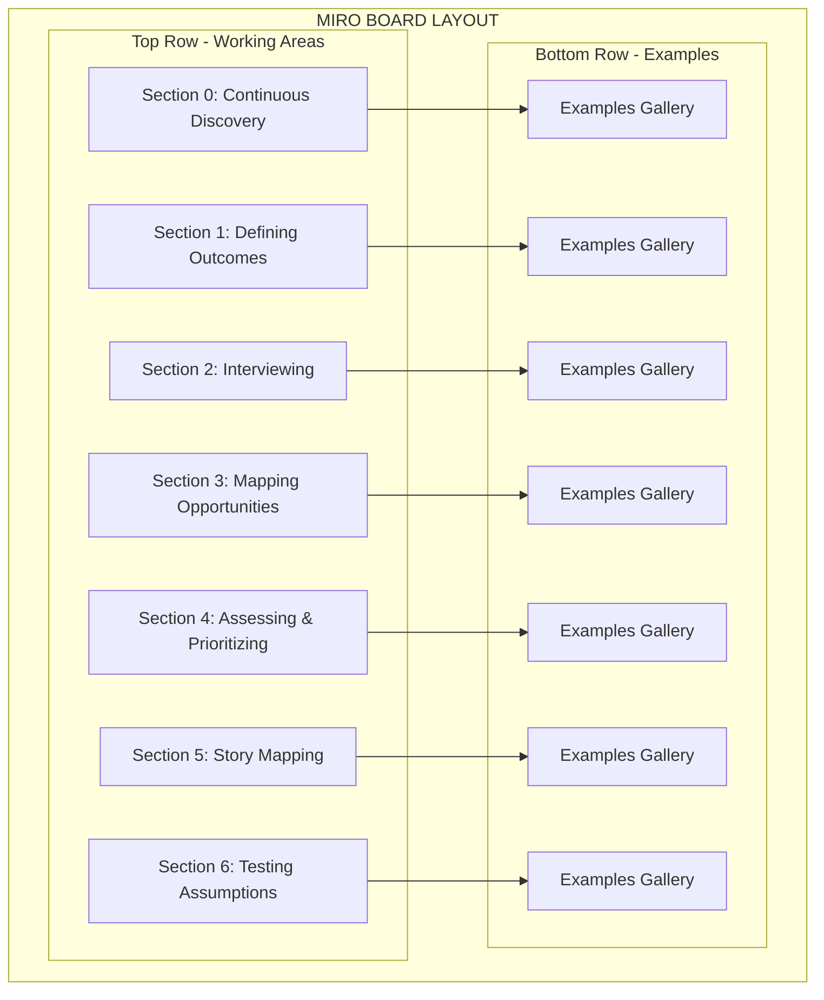

# Miro Board Recreation Plan: Continuous Discovery Habits Masterclass

## Board Overview
A comprehensive 7-section board for Continuous Discovery Habits training, featuring interactive workshops areas and example galleries.

## Board Structure

## Color Palette

| Color | Hex Code | Usage |
|-------|----------|-------|
| **Dark Blue** | #424867 | Section headers, category labels, examples background |
| **Light Gray** | #F5F5F5 | Main working area background |
| **Yellow** | #FFF740 | Primary sticky notes |
| **Green** | #A6E3A1 | Opportunity sticky notes |
| **Purple/Lavender** | #CBA6F7 | Story mapping cards |
| **Pink** | #F5C2E7 | Interview question cards |
| **Light Blue** | #89DCEB | Category labels |
| **Orange** | #FAB387 | Priority dots |
| **Red** | #F38BA8 | Priority dots |

## Detailed Section Breakdown

### Section 0: CONTINUOUS DISCOVERY HABITS MASTERCLASS
**Position**: Leftmost section  
**Background**: Dark blue (#424867)  
**Components**:

1. **AGENDA Box** (White background)
   - Title: "AGENDA"
   - 6 Class descriptions in 2x3 grid
   - Dark blue text on white

2. **Continuous Discovery Diagram** (White canvas)
   - Central flow diagram
   - Green boxes (3): "Feature" labels
   - Yellow boxes (3): "Email", "Chat", "Tests"
   - Mountain shapes: Outcome representations
   - Connecting arrows and paths

3. **Resource Links** (Bottom)
   - 4 white boxes with links:
     - ProductTalk.org
     - ProductTalk Academy
     - Continuous Discovery Habits Book
     - Slack Community

4. **Video Embed** (Bottom center)
   - YouTube player embed

### Section 1: DEFINING OUTCOMES
**Header**: "1. EVIDENCE-BASED TEAM DECISIONS, DEFINING OUTCOMES"  
**Components**:

1. **Header Bar** (Dark blue)
   - Title text in white
   - Slack logo integration

2. **Sticky Note Groups** (4 groups)
   - **BUSINESS OUTCOMES**: 
     - Subtitle: "Financial, topline, confidence"
     - 3 yellow sticky notes
   - **PRODUCT OUTCOMES**:
     - Subtitle: "Engagement-based, leading indicators"
     - 6 yellow sticky notes
   - **TRACTION METRICS**:
     - Subtitle: "Feature metrics"
     - 5 yellow sticky notes
   - Additional group with 3 yellow notes

### Section 2: INTERVIEWING
**Header**: "2. CONTINUOUS INTERVIEWING TO DISCOVER OPPORTUNITIES"  
**Components**:

1. **Interview Structure Diagram**
   - Blue box with interview flow
   - 4 pink sticky notes for question types
   - Rating scale (5 red dots)

2. **Interview Sections** (5 rows)
   - Each row has:
     - Dark blue header bar (interview category)
     - 5-6 yellow sticky notes
   - Categories include:
     - "WHO TO INTERVIEW"
     - Interview question types
     - Follow-up questions

### Section 3: MAPPING OPPORTUNITIES
**Header**: "3. MAPPING OPPORTUNITIES"  
**Components**:

1. **Key Moments Section**
   - Header: "IDENTIFY YOUR KEY MOMENTS"
   - 1 light blue category box
   - 4 green sticky notes (first row)

2. **Opportunity Brainstorm**
   - Header: "OPPORTUNITY BRAINSTORM"
   - 12 green sticky notes (3 rows of varied sizes)

3. **Creating Fast & Nimble Section**
   - Header bar (dark blue)
   - Additional space for activities

### Section 4: ASSESSING & PRIORITIZING
**Header**: "4. ASSESSING & PRIORITIZING OPPORTUNITIES, EFFECTIVE SOLUTION IDEATION"  
**Components**:

1. **Priority Scale**
   - 12 colored dots (red → orange → yellow → green → cyan)
   - Represents priority/scoring system

2. **Category Labels** (Left side)
   - 2 blue sticky notes
   - 4 green sticky notes

3. **Solution Ideation Grids**
   - 6 large grids (2 columns × 3 rows)
   - Each grid: 5×5 or 6×6 yellow sticky notes
   - Total: ~150-180 yellow notes

4. **Clustering Tactics Section**
   - Header bar
   - Additional priority dots

### Section 5: STORY MAPPING & ASSUMPTION MAPPING
**Header**: "5. STORY MAPPING, ASSUMPTION MAPPING"  
**Components**:

Three identical story map structures:

**Each Story Map Contains**:
1. **Epic Level** (Top row)
   - 4-5 yellow sticky notes

2. **Story Level** (Middle rows)
   - 4-5 yellow sticky notes

3. **Task Level** (Bottom grid)
   - 6×6 grid of purple/lavender sticky notes
   - ~36 cards per grid

**Total**: 3 complete story maps, ~120+ purple cards

### Section 6: TESTING ASSUMPTIONS
**Header**: "6. TESTING ASSUMPTIONS"  
**Subtitle**: "DEFINE PROTOTYPE TO TESTING ASSUMPTIONS"  
**Components**:

**6 Testing Canvases** (2 rows × 3 columns)

Each canvas structure:
- **Headers**: ASSUMPTION | SIMULATE | EVALUATE
- **Left Column** (Dark blue sticky notes):
  - Prototype
  - 1 Question Survey
  - Data Mining
  - Research Spike
- **Middle & Right Columns**: Yellow sticky note spaces

**Footer**: "Way to go! You just learned Continuous Discovery Habits! 🎉"

### Examples Section (Bottom Row)
**Background**: Dark blue (#424867)  
**Structure**: 
- Each section has 2-6 example images
- White borders around images
- Captions below each example
- Total: ~25-30 example artifacts

## Implementation Order

1. **Phase 1: Board Setup**
   - Create 7 vertical sections
   - Add section headers with numbering
   - Set background colors (light gray for work areas)

2. **Phase 2: Section Headers**
   - Add dark blue header bars
   - Insert white text titles
   - Add subtitles where applicable

3. **Phase 3: Content Creation (Per Section)**
   - Section 0: Agenda, diagram, links
   - Section 1: Yellow sticky note groups
   - Section 2: Interview templates with yellow notes
   - Section 3: Green opportunity notes
   - Section 4: Solution ideation grids
   - Section 5: Story mapping structures
   - Section 6: Testing canvases

4. **Phase 4: Examples Gallery**
   - Dark blue background strip
   - Upload/create example images
   - Add captions and borders

5. **Phase 5: Polish**
   - Align all elements
   - Verify color consistency
   - Add connecting elements
   - Insert completion message

## Sticky Note Counts

| Section | Yellow | Green | Purple | Pink | Blue | Total |
|---------|--------|-------|--------|------|------|-------|
| 0 | 3 | 3 | 0 | 0 | 0 | 6 |
| 1 | 17 | 0 | 0 | 0 | 0 | 17 |
| 2 | 30 | 0 | 0 | 4 | 1 | 35 |
| 3 | 0 | 16 | 0 | 0 | 1 | 17 |
| 4 | 180 | 4 | 0 | 0 | 2 | 186 |
| 5 | 30 | 0 | 108 | 0 | 0 | 138 |
| 6 | 48 | 0 | 0 | 0 | 24 | 72 |
| **Total** | **308** | **23** | **108** | **4** | **28** | **471** |

## Technical Specifications

### Board Dimensions
- Width: ~10,000px (7 sections × ~1,400px each)
- Height: ~2,500px (work area + examples)

### Element Sizes
- Sticky notes: 100×100px
- Section headers: Full width × 60px
- Grid spacing: 10px between notes
- Example images: 300×200px

### Font Specifications
- Headers: Bold, 18-24pt, White on dark blue
- Sticky notes: Regular, 12-14pt, Dark text
- Captions: Regular, 10-12pt

## Notes for Implementation

1. **Maintain Visual Hierarchy**: Section numbers should be prominent
2. **Consistent Spacing**: Keep uniform gaps between sections
3. **Color Coding**: Strictly follow the color palette for clarity
4. **Interactive Elements**: Ensure all sticky notes are editable
5. **Responsive Layout**: Elements should scale appropriately when zoomed
6. **Group Related Items**: Use frames or groups for easier manipulation

## Success Criteria

✅ All 7 sections clearly labeled and separated  
✅ Color coding matches original design  
✅ ~471 total sticky notes placed  
✅ Examples section with visual references  
✅ Professional workshop-ready appearance  
✅ Logical flow from discovery to testing  

---

**Ready for Review**: This plan provides complete specifications for recreating the Continuous Discovery Habits Masterclass board. Please review and approve before implementation begins.